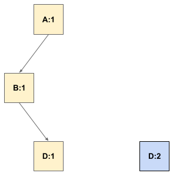

# What is a diamond dependency conflict?

A diamond dependency conflict is a scenario where two or more
libraries in a dependency tree consume a common library using
versioned references, and none of the common library versions in those
references contain all of the features that the consumers
expect. Consequently, it is not possible to select a set of versions
that form a working program.

A visual representation may help clarify the idea. Let's use an
example that starts with three libraries: A, B, and D, each at version 1.
In the beginning, everyone is happy.

Now D introduces version 2, which adds some features but also removes
some features (which we call a breaking change). This doesn't create a
problem for the existing library versions.

C comes along and decides to depend on version 2 of D because it's the
latest and greatest. Everything is still ok at this point.

Now A wants to add a dependency on C. This creates a diamond
dependency conflict. B:1 can only work with D:1, while C:1 can only
work with D:2, so no matter which version of D you choose, the program
will blow up.

If we choose D:2, then B blows up:

If we choose D:1, then C blows up:

In order to move the ecosystem forward, B needs to create a new
version 2, which is compatible with D:2. Then, A can form a successful
diamond.

Diamond dependency conflicts are particularly difficult to solve
because the changes required to solve them can't be made by either the
root of the dependency tree (here, A) or the common library in
conflict (here, D); the updates need to be made in one or more
intervening libraries (here, B). At the same time, the library that
needs updates (library B) has no incentive to make the
change. Consequently, diamond dependency conflicts must be solved at
an ecosystem level instead of purely at the local level.

The rest of this site ([jlbp.dev](https://jlbp.dev)) describes a set of best practices to
be applied to an ecosystem in order to achieve a state where diamond
dependency conflicts either don't occur or are very rare. All of the
libraries in the ecosystem must follow the rules to maintain this
state of compatibility.

If you want to understand diamond dependency conflicts more deeply, proceed to
the next article,
[Why doesn't the compiler catch diamond dependency conflicts?](0002-why-doesnt-the-compiler-catch-diamond-dependency-conficts.md).
