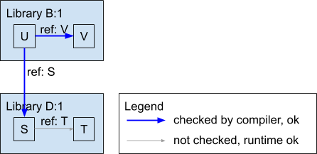

# Why doesn't the compiler catch diamond dependency conflicts?

When first introduced to the problem of [diamond dependency conflicts](0001-what-is-a-diamond-dependency-conflict.md),
many people ask: "Why doesn't the compiler catch it?" To explain why, we need
to dive into how the Java build process works.

When `javac` compiles a program, it verifies that every class, variable, or
other type of symbol referenced by the code can be found somewhere. Let's look
at an example. We start with the most basic case, a library with no
dependencies. In this case, all symbolic references must exist within the
library itself (or in the Java runtime, but let's ignore that for our purposes).

In this example we have library D with classes S and T. Class S uses class T (so
we can say that class S "references" class T). We are also going to track the
version of library D (here, version 1), because this will be important later.

If T is missing, the compiler refuses to compile library D, and it is impossible
to execute the code. If everything is in order, the compiler builds a jar. This
jar can now be used by other libraries.

Now let's add another library B, which depends on library D. It contains a class
U and class V. Class U refers to class V in its own library (library B) and also
to class S in library D.

When we compile library B, the compiler checks references both within the
library (here, from class U to class V) and references from code inside the
library to symbols outside of the library (here, from class U to class S in
library D). The compiler doesn't check references made by code outside of
itself, so it doesn't check the reference made by class S in library D to class
T. Note that class T can't be missing in library D because otherwise library D
wouldn't compile in the first place (per the prior step).

If we tried to switch library B's dependency on D:1 to D:2 which has class S2
instead of S, then library B would not compile:

Thus, in this scenario where we only have direct dependencies, the compiler will
catch all missing references.

Now let's add another layer called library A. It contains a class W and class
X. Class W refers to class X in its own library (library A) and also to class U
in library B.

When we compile library A, the compiler checks internal references (from class W
to class X) and references from internal code to external external symbols (from
class W to class U), but that's where it stops. The references from class U to
other classes (class V in library B and class S in library D) were verified when
compiling library B, so they are not verified again when compiling library A.

If we use D:2 instead of D:1, library A still compiles since the references made
by library B are not checked. The problem shows up later when class W is invoked
at runtime: class W calls a method in class U which in turn tries to call a
method in class S, but class S is missing, so the runtime throws a
`ClassNotFoundException`.

So far we have only considered a linear dependency chain, and the scenario
described above might seem unlikely because there is no reason for the wrong
version of D to be chosen. However, as soon as we add a diamond dependency
conflict, we see the relevance. All versions of D have a problem, but the
compiler doesn't tell us about it - instead, we only find out at runtime. If D:1
is used, then the reference from class Y to class S2 fails at runtime:

Conversely, if D:2 is used, then the reference from class U to class S fails at
runtime:

This behavior of Java makes diamond dependency conflicts particularly
pernicious. Theoretically, we should be able to tell that our program will fail
before we even run it, but Java does not tell us.

If you want to understand how version resolution works in Maven and Gradle,
proceed to the next article,
[How does version resolution work in Maven and Gradle?](how-does-version-resolution-work-in-maven-and-gradle.md).
