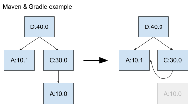

# How does version resolution work in Maven and Gradle?

The build system that you choose for building your Java code determines which
version resolution algorithm is used to choose the versions of your
dependencies. Unfortunately, the two most popular build systems (Maven and
Gradle) use different version resolution algorithms. This article explains how
the algorithms of these two build systems work and how they interact with each
other. No matter which build system you choose, you are likely to have direct or
indirect dependencies that use the other one, so you need to understand how both
work. To limit the scope, we ignore other build environments like Eclipse and
Ant that are not based on the Maven repository system and that work differently.

Maven and Gradle use different names for the process of selecting dependency
versions: Maven calls the process *dependency mediation*, while Gradle calls the
process *version conflict resolution*. In this article, we use the term *version
resolution*, omitting the word "conflict" so that the process is not confused
with program-breaking conflicts that we discuss elsewhere. 

Before looking at Maven and Gradle specifically, it's important to understand
the concepts of version resolution in general. The input of this process is a
dependency graph which reflects the dependencies as specified by each library in
the graph, which we call an *unresolved dependency graph*. In such a graph,
there can be multiple versions of each library. The version resolution process
walks the unresolved dependency graph and decides which version to use for every
library encountered. Whether or not the build tool produces a graph as an output
of this resolution, it is useful to think of this output in terms of a new
graph. We call the graph representation of this output a *resolved dependency
graph*. Here is a visual representation of the process:

For example, we could have an unresolved graph that looks like this:

In this graph, there are two versions of A (10.0 and 10.1). The version
resolution process picks a single version for A, which could be either version
depending on the algorithm. If A:10.0 is picked, the resolved dependency graph
looks like the following. In this graph, C's dependency on A:10.1 is overridden.

If A:10.1 is picked, the resolved dependency graph looks like the following. In
this graph, B's dependency on A:10.0 is overridden.

So why do we need to pick a single version? The reason is that each class loader
only loads one version of each fully-qualified class name at runtime. So, if you
put multiple versions on the classpath, you do not get both versions at
runtime. Java build systems handle this issue upfront by picking a single
version for each library before the classpath is even constructed.

Now let's look at the version resolution algorithms used by Gradle and
Maven. Let's consider Gradle first because it is the simpler one to
describe. Simply put, Gradle chooses the highest version encountered in your
dependency graph. For the example above, Gradle picks A:10.1.

Gradle applies the higher-version rule even if it overrides one of your own
direct dependency declarations:

Next consider Maven. Maven chooses the version that is closest to the root of
the dependency graph, and if there is a tie, it chooses the version it
encounters first. Another way to describe the algorithm is that Maven chooses
the first version encountered when traversing the dependency graph in
breadth-first order. Looking at the same unresolved dependency graph we used
in Gradle example 1:

As you can see by comparing the resolved graphs, Maven makes the opposite
choice. Now consider at the second example, where the root has both a direct and
indirect dependency on the same library:

In this case, Maven chooses A:10.0 because it is only 1 hop away from the root
instead of 2 hops (A:10.1). In this case, Maven also makes the opposite choice
of Gradle.

It should be noted that Maven and Gradle don't always make the opposite choice.
In the following example, the highest version is also the closest to the root,
so Maven and Gradle both choose A:10.1.

## Interaction between Maven and Gradle

When a library is built, its build system performs version resolution for its
entire dependency graph. Since the build systems of the libraries in that
dependency graph also perform their own version resolution, the versions
selected can be different, especially when a consumer uses a different build
system than its dependencies. Sometimes, the version selected by the consumer
can be incompatible with the version selected by the dependency when the
dependency is built by itself.

Consider an example using Gradle example 2 as its basis, where library D depends
on A:10.0 and C:30.0 (and thus indirectly A:10.1). Assume C depends on a feature
added into 10.1. This means that if 10.0 is selected, C fails at runtime. From
library D's perspective, this is fine, since Gradle chooses version 10.1.

Suppose we add a new library E which uses Maven as its build system, and which
adds D as a dependency. When E is built, Maven resolves the whole dependency
graph, including D's subgraph, even though Gradle resolved the subgraph of D for
when D was originally built. When Maven performs its version resolution,
it chooses a different version of A (10.0) than Gradle did (10.1), which breaks
C. This happens even though D works perfectly fine internally.

As a consequence, the author of library E might file a bug against library
D. The author of library D would argue that there is no bug. From their individual
perspectives, are both right. From the ecosystem perspective, the author of
library D unfortunately needs to adapt its dependencies so they don't cause
problems for Maven consumers (even though they may have sworn off Maven and use
Gradle exclusively). In this case, they have an easy fix - they can upgrade the
direct dependency of D on A:10.0 to A:10.1, so that both build systems select
the same version, and everyone is happy.

There are many more possible scenarios which require more complicated
fixes. Solving those problems will be the topic of another article.

For more details on each build system, see their respective documentation:

- **Maven**: [Introduction to the Dependency Mechanism](http://maven.apache.org/guides/introduction/introduction-to-dependency-mechanism.html)
- **Gradle**: [Understanding dependency resolution](https://docs.gradle.org/current/userguide/dependency_resolution.html)
