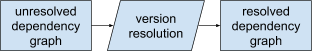
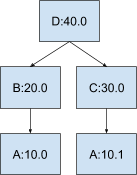
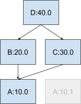
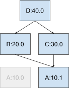
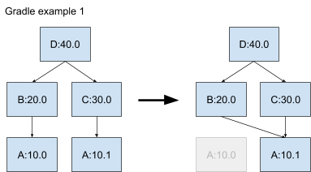
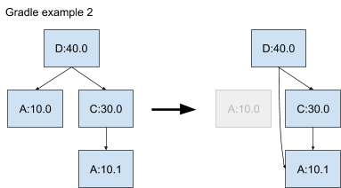
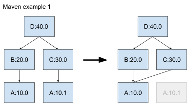
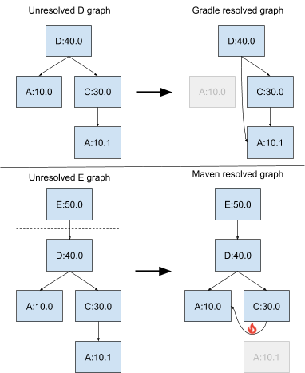
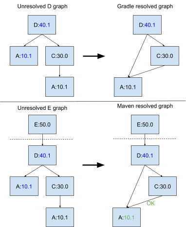

# How does version resolution work in Maven and Gradle?

The build system that you choose for building your Java code determines which
version selection algorithm is used to choose the versions of your
dependencies. Unfortunately, the two most popular build systems in open source
(Maven and Gradle) use different version resolution algorithms. No matter which
of the two you choose, you are likely to have direct or indirect dependencies
that use the other one, so you need to understand how they both work when your
dependency graph experiences conflicts.

Before we look at Maven and Gradle specifically, we need to understand what
happens in the version resolution process. The input of this process is a
dependency graph which reflects the dependencies exactly as specified by each
library in the graph, which we call an unresolved dependency graph. In such a
graph, there can be multiple versions of each library. The version resolution
process walks the unresolved dependency graph and produces a new graph where
each library has only one version. We call this output a resolved dependency
graph. Here is a visual representation of the process:

For example, we could have an unresolved graph that looks like this:

In this graph, there are two versions of A (10.0 and 10.1). The version
resolution process picks a single version for A, which could be either version
depending on the algorithm. If A:10.0 is picked, the resolved dependency graph
looks like the following. In this graph, C's dependency on A:10.1 is overridden.

If A:10.1 is picked, the resolved dependency graph looks like the following. In
this graph, B's dependency on A:10.0 is overridden.

So why do we need to pick a single version? The reason is that Java's default
class loader only loads one version of each fully-qualified class name at
runtime. So, if you try to put multiple versions on the classpath, you would not
get both versions at runtime. Java build systems handle this issue upfront by
picking a single version for each library before the classpath is even
constructed.

Now let's look at the version resolution algorithms used by Gradle and
Maven. Let's consider Gradle first because it is the simpler one to
describe. Simply put, Gradle chooses the highest version encountered in your
dependency graph. For the example above, Gradle would pick A:10.1.

Gradle applies the higher-version rule even if it overrides one of your own
direct dependency declarations:

Next let's consider Maven. Maven chooses the version that is closest to the root
of the dependency graph, and if there is a tie, then it chooses the version it
encounters first. Another way to describe the algorithm is that Maven chooses
the first version encountered when traversing the dependency graph following a
breadth-first traversal. Looking at the same example we used first for Gradle:

As you can see if you compare the resolved graphs, Maven makes the opposite
choice of Gradle in this circumstance. Let's look at the second example, where
the root has both a direct and indirect dependency on the same library:

In this case, Maven chooses A:10.0 because it is only 1 hop away from the root
instead of 2 hops (A:10.1). In this case, Maven also makes the opposite choice
of Gradle.

So where can the mixture of these two build systems cause a problem? The
resolved dependency graph can experience conflicts when the two build systems
come to different decisions for a particular subgraph of a dependency graph.

Let's look at an example, starting with Gradle example 2, where library D
depends on A:10.0 and C:30.0 (and thus indirectly A:10.1). Let's also say that C
depends on a feature added into 10.1. This means that if 10.0 is selected as the
resolved version, then C will fail at runtime. From library D's perspective,
this is fine, since Gradle chooses version 10.1.

Let's add a new library (let's call it library E) which uses Maven as its build
system, and which adds D as a dependency. When E is built, Maven will resolve
the whole dependency graph, including D's subgraph, even though Gradle resolved
the subgraph of D for itself when D was originally built. When Maven performs
its version resolution, it chooses a different version of A (10.0) than Gradle
did (10.1), which breaks C. This happens even though D works perfectly fine
internally.

As a consequence, the author of library E might file a bug against library D
because it seems to have a bug. The author of library D would argue that there
is no bug from their perspective. From their narrow perspectives they are both
right. From the ecosystem perspective, the author of library D unfortunately
needs to adapt their dependencies so that they don't cause problems for Maven
consumers (even though they may have sworn off Maven and use Gradle
exclusively). In this case, they have an easy fix - they can upgrade the direct
dependency of D on A:10.0 to A:10.1, so that both build systems make the same
version resolution decisions, and everyone can be happy.

There are many more possible scenarios which require more complicated
fixes. Solving those problems will be the topic of another article.
